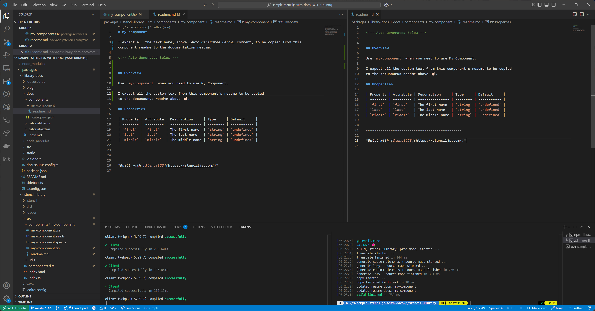
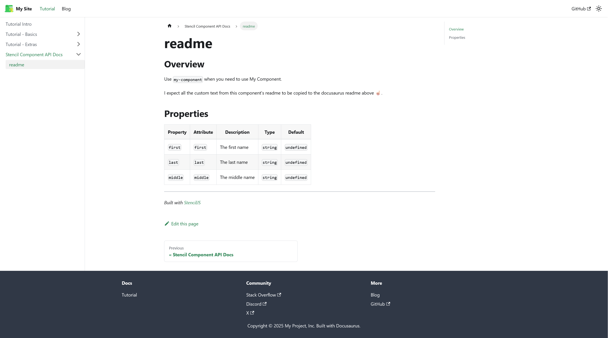

# sample-stenciljs-with-docs

This is a sample project to demonstrate how I'm using the StencilJS component Readmes as the source of truth for my documentation and how this is now messy with the changes made via [@stencil/core#5648](https://github.com/stenciljs/core/pull/5648), which now only copies over the autogenerate portion of the component readme instead of the whole file.

## How this is setup

Using the Stencil `docs-readme` output target the component readmes (in [`packages/stencil-library`](packages/stencil-library)) are copied to the Docusaurus [`packages/library-docs/docs/components`](packages/library-docs/docs/components) folder so they can be built into the documentation platform.

The [`packages/library-docs/docs/components`](packages/library-docs/docs/components) is setup in the `.gitignore` to ignore any changes to the contents of this folder so that it can be automatically populated via the build process of the component library.

The changes in [@stencil/core#5648](https://github.com/stenciljs/core/pull/5648) detect the use of the `dir` property and treat the readmes in the destination listed as custom readmes, and try and only append the auto generated part to them, even if they don't exist.  This leaves the Readmes lacking any content above the `<!-- Auto Generated Below -->` annotation.

## The Readmes Side-by-Side

On the right is the original component readme file from the `stencil-library` and on the right is the copied readme within the `library-docs`

## What the output looks like in the rendered Docusaurus platform

When the copied readme is rendered it is missing all of its content and renders as a practically blank default page.

## Why do I want to use the component readmes as the source of truth?

I want to use the readmes as the source of truth because this allows me to keep the documentation close to the stencil components, this way it shows up in GitHub/GitLab, Docusaurus, and anywhere else looking the same without having to maintain a number of copies around the project.